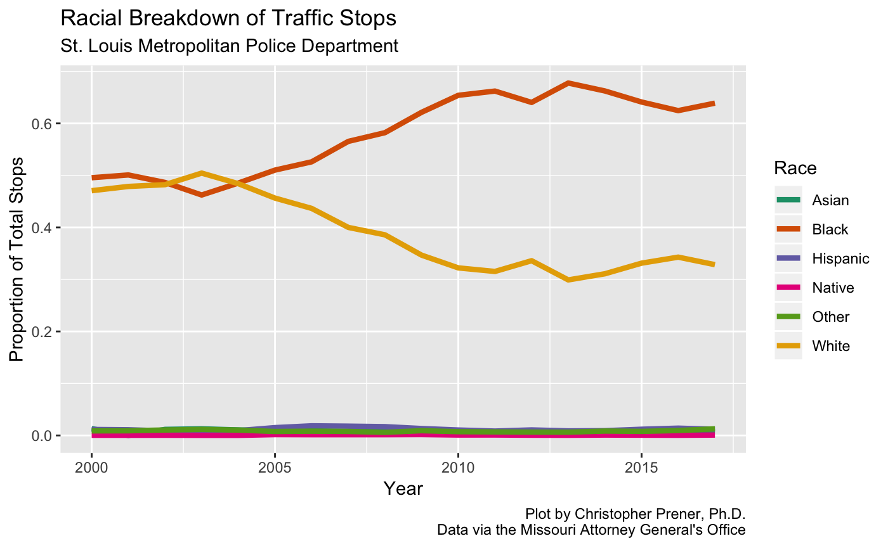

<!-- README.md is generated from README.Rmd. Please edit that file -->

```{r setup, include = FALSE}
knitr::opts_chunk$set(
  collapse = TRUE,
  comment = "#>",
  fig.path = "man/figures/README-",
  out.width = "100%"
)
```

# movsr - Missouri Vehicle Stops Report Data

[](https://www.tidyverse.org/lifecycle/#experimental)
[](https://cran.r-project.org/package=movsr)

`movsr` is research software designed to scrape and reformat the [Missouri Attorney General's Office](https://ago.mo.gov/) [annual vehicle stop reports](https://ago.mo.gov/home/vehicle-stops-report/). These data are important because they have the potential to reveal continued inequities in Missouri's criminal justice system. The Department of Justice's [report](https://www.justice.gov/sites/default/files/opa/press-releases/attachments/2015/03/04/ferguson_police_department_report.pdf) on the Ferguson Police Department, for example, highlights the way traffic tickets have been as an approach to revenue generation:

> Ferguson has allowed its focus on revenue generation to fundamentally compromise the role of Ferguson’s municipal court. The municipal court does not act as a neutral arbiter of the law or a check on unlawful police conduct. Instead, the court primarily uses its judicial authority as the means to compel the payment of fines and fees that advance the City’s financial interests. This has led to court practices that violate the Fourteenth Amendment’s due process and equal protection requirements. The court’s practices also impose unnecessary harm, overwhelmingly on African-American individuals, and run counter to public safety.

These same practices have also been discussed in the [Ferguson Commission’s report](https://forwardthroughferguson.org/) and have been the subject of [some attempted reforms](https://www.stltoday.com/news/local/crime-and-courts/st-louis-county-municipal-courts-agree-to-uniform-fines-court/article_7851b8a5-52d3-59e6-804c-4f2883acbc77.html). 

Yet, despite continued tracking of traffic stops at the state level since 2000 and the increased attention paid to policing practices in the region after [Michael Brown's death](https://en.wikipedia.org/wiki/Shooting_of_Michael_Brown), disparities in traffic stops remain. Many departments stop greater numbers of African Americans than the composition of the driving age population would predict. For example, the St. Louis Metropolitan Police Department's traffic data suggests that African Americans, who make up 45% of the city's population, account for over 60% of traffic stops:



## For Researchers
The package's [website](https://slu-openGIS.github.io/movsr/) offers a walk through in the [Get started article](https://slu-openGIS.github.io/movsr/articles/movsr.html) for using `movsr` for scraping and formatting vehicle stop data as well as [documentation](https://slu-openGIS.github.io/movsr/reference/index.html) for project specific functions.

The `movsr` software can be accessed from GitHub with `remotes`:

```r
# install.packages("remotes")
remotes::install_github("slu-openGIS/movsr")
```

Additional details, including some tips for installing and using Docker, can be found in the [Get started article](https://slu-openGIS.github.io/movsr/articles/movsr.html#getting-started) as well.
